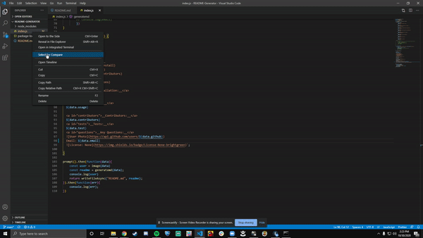

 # README Generator
  IN this project i created a readme generator using inquirer and node.js in order ot automatically create a readme for any project the user desires using aprompt in js
## Video of App

  ___Table-of-Contents___
  1. [How to install](#install)
  2. [How to Use](#usage)
  3. [Contributions](#contributors)
  4. [Tests](#tests)
  5. [Questions](#questions)
  
  <a id="install">__Installation:__</a>
  In order to install and use the application you would need to have node.js installed in order to access npm which is wher you can install all of the needed libraries using 'npm install' in order to properly run the code and execute it. In the termnal you will need to type 'node index.js' in order to run the program and use the prompts
  
  <a id="usage">__Usage:__</a>
  You would use this application in order to automate your readme file creation instead of manually typing the README this will create the file automatically foor you with the proper information
  
  <a id="contributors">__Contributors:__</a>
  Gabriel Pineda
  <a id="tests">__Tests:__</a>
  None
  <a id="questions">__Any Questions:__</a>
  
  Email: {email}
  